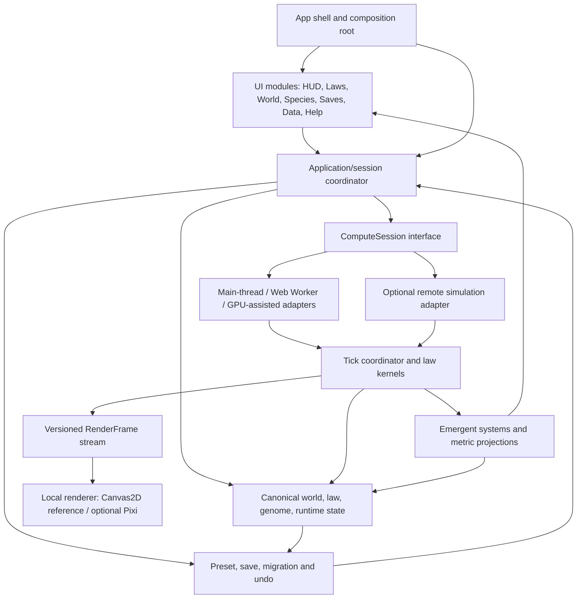
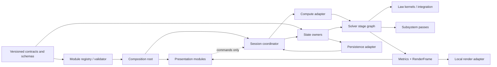
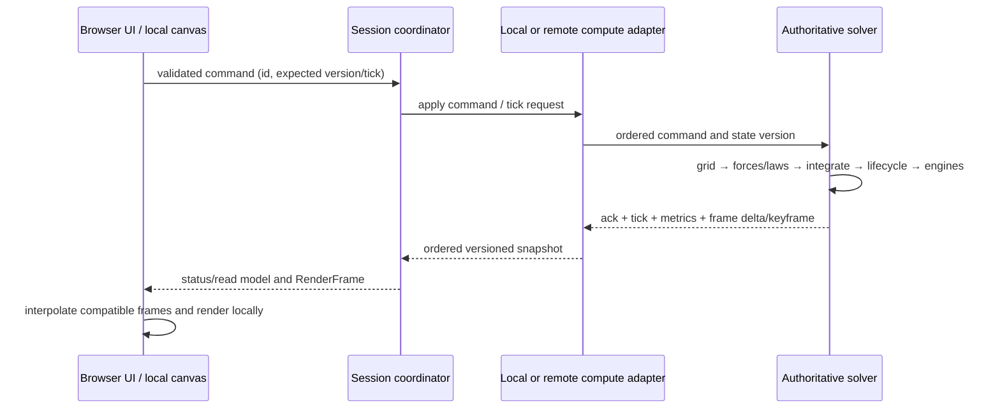
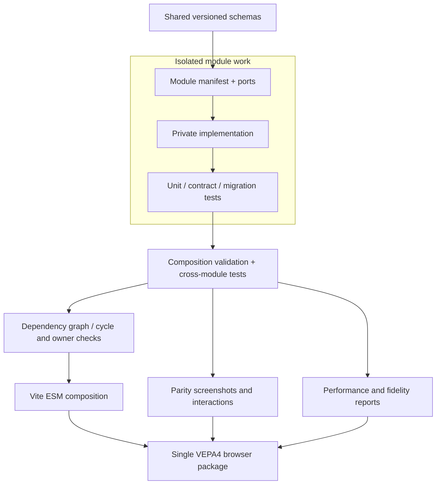

# VEPA4 RB Modular-System Upgrade — Master Specification

**Status:** Proposed design only; no application implementation authorized by this document. **Scope:** future modular-system upgrade (“RB”). **Baseline inspected:** VEPA4 v9.3.0, branch `main`, HEAD `2f8ca03`. **Audience:** product/architecture reviewers, module owners, integrators and test authors.

This master combines the complete component specifications from this directory after a source-grounded baseline and a system-level design. “Current” labels describe inspected source; “Target” labels are proposals. A diagram is a design boundary, not a claim that a component or cloud service already exists. Counts are snapshot values and must be rechecked at implementation time.

## Multi-tier table of contents

### I. Orientation and current contract
1. [Purpose, authority and scope](#1-purpose-authority-and-scope)
2. [Current-state facts and visual parity target](#2-current-state-facts-and-visual-parity-target)

### II. Target architecture
3. [Combined architecture](#3-combined-architecture)
   - 3.1 [Logical module view](#31-logical-module-view)
   - 3.2 [Dependency and ownership view](#32-dependency-and-ownership-view)
   - 3.3 [Local/remote tick and render dataflow](#33-localremote-tick-and-render-dataflow)
   - 3.4 [Isolated development and one-package integration](#34-isolated-development-and-one-package-integration)
4. [Cross-cutting contracts](#4-cross-cutting-contracts)
   - 4.1 [Authoritative state and transactions](#41-authoritative-state-and-transactions)
   - 4.2 [Easy/Advanced parameter experience](#42-easyadvanced-parameter-experience)
   - 4.3 [Physics performance and law fidelity](#43-physics-performance-and-law-fidelity)
   - 4.4 [Cloud execution, security and recovery](#44-cloud-execution-security-and-recovery)
5. [Parity, verification and migration gates](#5-parity-verification-and-migration-gates)
6. [Open decisions / approval gates](#6-open-decisions--approval-gates)

### III. Complete component specifications (source copies)
7. [00 — Current program baseline](#7-00--current-program-baseline)
8. [01 — App shell and orchestrator](#8-01--app-shell-and-orchestrator)
9. [02 — Visual shell and UI modules](#9-02--visual-shell-and-ui-modules)
10. [03 — World parameter system](#10-03--world-parameter-system)
11. [04 — Species and genome system](#11-04--species-and-genome-system)
12. [05 — Law ontology and fidelity](#12-05--law-ontology-and-fidelity)
13. [06 — Physics solver and performance](#13-06--physics-solver-and-performance)
14. [07 — Execution backends and cloud processing](#14-07--execution-backends-and-cloud-processing)
15. [08 — Local renderer and visualization](#15-08--local-renderer-and-visualization)
16. [09 — State, presets and persistence](#16-09--state-presets-and-persistence)
17. [10 — Emergent systems and observability](#17-10--emergent-systems-and-observability)
18. [11 — Module packages, development and integration](#18-11--module-packages-development-and-integration)

## 1. Purpose, authority and scope

Specify a future modular VEPA4 system that can be developed and tested in isolated modules, then composed into one deliverable that preserves current program behavior and visual identity while enabling performance work, improved law fidelity, remote simulation with local presentation, and easier parameter control. This is a design basis, not an implementation plan with already-approved algorithms, parameter values, cloud vendor, or release commitment.

The acceptance word “faithful” is governed by explicit characterization and compatibility gates, not a claim of pixel-identical output from reading source. Preserve a working legacy path during incremental migration; any deviation requires an explicit decision and user-visible documentation. New parameters and Easy Mode composites are proposed data-model work; do not add speculative values or physical semantics here.

## 2. Current-state facts and visual parity target

The browser app is vanilla ESM/DOM with Vite, Vitest, Playwright and one npm package. `index.html` stacks atmospheric and simulation canvases under a pointer-enabled interface. The Sanguine dark/neon-noir theme uses near-black translucent panels, compact monospace labels, fine borders, small glows, a red active setup accent, spectrum-colored law tiles, and cyan/blue/gold/green highlights. A 36px toolbar has pause, live population/species/tick telemetry, chaos/restart, undo and help. A resizable bottom drawer holds Setup, Saves and Data; setup contains Laws/World/Species/Settings, while Data has intelligence, DNA, logs, groups, ecosystem and civilization views. Tabs, accordions, advanced slider features, responsive touch affordances, keyboard navigation, camera and help are functional parity scope.

Live contracts observed: particle stride 100 floats; up to 100,000 particles; DNA 64 traits × 64 species in quantized U16 storage (42 per-particle cached, 22 genome-only); world schema currently 149 definitions; law count 136, indices 0–135 in five U32 words serialized `{low,high,ext,quad,penta}`. Main-thread orchestration remains concentrated in `src/main.js`; worker uses SharedArrayBuffer when available, with fallback paths. Canvas2D is the reference renderer; PixiJS is optional. WebGPU today is a limited gravity pre-pass, CPU solver remains authoritative for the other semantics. Barnes–Hut/FMM are approximate paths with documented loss of some per-pair modifiers. No remote compute service exists in the inspected code.

**Parity target:** preserve boot/scenario selection, appearance, navigation, laws, world/species editing, presets, pause/restart/chaos, renderer choice/fallback, analytics, saves/import/export/undo, deterministic fixtures and worker fallback. Record screenshot/interaction fixtures and state summaries before extraction. Test all screens on an actual browser; DOM stubs are not visual/browser proof.

## 3. Combined architecture

### 3.1 Logical module view

**Annotation:** the composition root wires one owner per mutable aggregate. UI issues commands and observes read models; it never writes particle buffers. Local and remote adapters implement the same compute port, but remote is optional and must not block local boot. RenderFrames are presentation snapshots, not authority for simulation state.

### 3.2 Dependency and ownership view

**Ownership rules:** canonical schemas are immutable; state aggregates each have one write owner; law kernels declare read/write sets; analytics are read-only projections unless an explicit bounded action is issued; renderer owns no physics state. Cycles and duplicate ownership are composition errors.

### 3.3 Local/remote tick and render dataflow

**Transport annotation:** a snapshot identifies session, sequence, tick, schema and base keyframe. Missing sequences trigger resync; bounded queues drop/coalesce only stale render frames, never reorder authoritative commands. Full particle memory is not copied each frame. Disconnection freezes the last coherent frame and reports staleness; local continuation requires explicit checkpoint transfer and a defined state guarantee.

### 3.4 Isolated development and one-package integration

Modules are independently testable and contract-isolated in the repository; this does not require independent release artifacts or duplicate dependency trees. Vite still emits one integrated application. No private module import, implicit singleton mutation, duplicate owner, or undocumented schema change crosses the boundary.

## 4. Cross-cutting contracts

### 4.1 Authoritative state and transactions

Partition simulation state (particles, DNA, laws, world params, PRNG/tick clocks and mutable subsystem records), presentation state (camera, active panels and independent World/Species mode preferences), and execution metadata (authority/backend/latency). All changes pass through validated commands and a state transaction with source/provenance, version and affected keys. Coalesce continuous slider movement into one undo gesture. UI display preferences do not mutate world physics or consume world undo entries. Version schemas and migrate before applying, not midway through mutation.

### 4.2 Easy/Advanced parameter experience

World and Species each expose independent toggles. Default both to Easy for new and first-run sessions. Advanced reveals every live canonical world parameter and every genome trait. Easy is a view/profile over the same complete values; it must not delete, reset, or hide data from saves. Each Easy recipe declares affected keys, formula, bounds, units, constraints, reset/reseed behavior, provenance, and reverse projection. Switching modes preserves all values. Divergent manual edits mark a group customized; Easy shows affected settings before applying. No concrete composite mapping or additional parameter list is settled in this spec; domain review is required.

### 4.3 Physics performance and law fidelity

Profile representative loads first; measure CPU, GPU, worker, render, memory, queue and frame metrics separately. Keep exact CPU as reference; treat FMM/Barnes–Hut/GPU/cloud as distinct algorithms with documented error and feature support. Every law needs explicit behavior, dependencies, state, tests, edge cases, stability bounds, known approximations and audit evidence. A UI tile is not proof of dispatch or scientific fidelity. Benchmark a workload matrix including population, density, law mix, fields, seeds and device; make no speedup claim without timings and no fidelity claim without differential/behavior evidence.

### 4.4 Cloud execution, security and recovery

Provider-neutral remote adapter is opt-in; local execution is always available. Browser retains UI, camera and local rendering. Use authenticated, scoped, versioned command envelopes and compact sequenced render snapshots/deltas with keyframes and resync. Define session identity, tenancy, limits, cost warning, data retention/deletion, reconnect window, privacy and security before selecting a provider. Never embed service secrets in the browser. Do not silently fork authority or claim deterministic continuation unless the complete mutable state and RNG/cadence are captured.

## 5. Parity, verification and migration gates

1. **Baseline:** inventory routes/panels/gestures, theme/layout screenshots at representative sizes, launch presets, laws, world/DNA edits, event outputs, save fixtures and worker/GPU/renderer fallbacks. Record seeded world summaries.
2. **Contracts:** formalize schemas, module manifests, commands/events, state ownership and module test harness. Reconcile stale docs against live source before moving code.
3. **Characterization:** tests must cover current behavior before extraction; preserve old entry facade while forwarding to new boundaries. Existing test names or DOM stubs alone do not establish browser parity.
4. **Incremental extraction:** pure schemas/helpers → state/session services → UI/read models → solver stages → adapters. After each move, run unit/contract/integration tests and compare baseline.
5. **Parameters/laws:** validate Easy mappings and all Advanced fields; test serialization and migrations. Approve each new parameter/law separately with consumer, semantic contract, migration, stability/fidelity tests, help/audit.
6. **Compute/render:** measure local baselines, exact CPU comparisons and fallback behavior; browser-test Canvas2D/Pixi and remote snapshots/interpolation, loss/reconnect, queue backpressure and stale-frame handling.
7. **Release readiness:** complete full test/syntax/spec/build/repository gates; actual browser verification and limitations recorded; verify save compatibility, rollback and user-visible backend states. Release, version bump, deployment and Git delivery require their own authorization.

Acceptance requires one integrated package, no missing current essential flows, versioned contracts, testable isolation, no UI access to simulation internals, all current settings accessible in Advanced, Easy values round-tripping without loss, CPU reference parity within declared deterministic/statistical tolerances, and observable local rendering regardless of compute location.

## 6. Open decisions / approval gates

- Exact Easy Mode composite values, names, units, formulas, save scope, and behavior for customized mixed values.
- Whether any new world or species parameters are justified; each requires evidence and approval. Existing counts are snapshot only.
- Remote provider, region, identity/auth, tenancy, billing/cost budgets, data residency/retention, maximum population, latency targets and offline/reconnect semantics.
- Which solver stages may be approximate or GPU/cloud accelerated, with per-law parity tolerances and acceptable determinism.
- Module packaging/workspace tooling and public contract version policy; choose after dependency graph and team workflow review.
- Browser test matrix and screenshot acceptance tolerances for visual parity.

Do not silently choose answers to these questions in code. Capture decision, owner, rationale, reversibility and acceptance evidence before implementation.

### Verbatim copies of the component specs

The sections above are the annotated, hierarchical integration of each component. The following details blocks reproduce each separately maintained component file in full, so this master remains a self-contained copy as requested.

00 — Current program baseline (verbatim)

# 00 — Current program baseline

**Status:** observed baseline, not a target architecture. Evidence snapshot: `main` at `2f8ca03`; clean at inspection. Runtime truth remains the source tree.

## Product and visual language

VEPA4 is a vanilla ESM browser simulation packaged by Vite. The page is a full-viewport, dark neon-noir petri dish: `body.theme-sanguine`, near-black background and translucent panels, compact monospace labels, red as the active setup accent, cyan/blue/gold/green highlights, thin borders, small glows, and color-coded law tiles. `index.html` layers an atmospheric `#bg-canvas`, live `#sim-canvas`, and pointer-enabled UI. A 36px top toolbar carries pause, population/species/tick telemetry, chaos/restart, undo, and help. The bottom drawer defaults to at most 50vh and contains SETUP, SAVES, DATA; Setup nests LAWS, WORLD, SPECIES, SETTINGS; Data nests intelligence, DNA, logs, groups, ecology, civilization. Drawer resize/hide/minimize/zoom, keyboard tabs, tooltips/help, responsive touch affordances, analytical canvases, and accordion controls are part of the observable UI contract—not decorative extras.

Laws are shown as spectrum-coded icon tiles with list/compact variants, category filtering, search, and help/details. World settings are grouped into dense accordions with enhanced sliders (bounds, linear/log choice, snap, precision zoom). Species has a roster and trait accordion. Canvas2D is the reference renderer; PixiJS is optional with Canvas2D fallback. Preserve visual hierarchy, active/inactive states, status feedback, keyboard behavior, touch targets, and responsive drawer composition in any parity milestone.

## Functional inventory / hard contracts

- `src/main.js` is the current integration orchestrator: boot/launch settings, seed, world and species setup, events, worker bridge, render loop, population and intelligence cadence, saves/undo, and lifecycle wiring. At 1,931 lines, it is an integration hotspot, not a clean module boundary.
- Particle state is a flat 100-float stride; max population is 100,000. DNA is 64 parameters × 64 species, quantized in `Uint16Array`; 42 values are cached in each particle and 22 are genome-only. Law SSOT is `LAW_INDEXES`/`LAW_COUNT=136`, five U32 words, serialized `{low,high,ext,quad,penta}`.
- `WORLD_PARAM_DEFS` currently contains 149 entries. It is the world-parameter schema, distinct from species DNA and runtime-only tuning. `LAW_INDEXES`, `DNA_INDEXES`, `STRIDE_INDEXES`, and parameter definitions are the SSOTs; no magic indices in consumers.
- Main thread owns UI/rendering/orchestration; `src/worker/physics.worker.js` executes serialized ticks against SharedArrayBuffer when available. ArrayBuffer/main-thread fallbacks exist. Optional WebGPU currently computes a limited gravity force pre-pass; CPU remains authoritative for the rest of solver semantics. Barnes–Hut/FMM gravity are approximations; exact pairwise CPU is the reference.
- Solver combines spatial-neighbor building, pairwise law dispatch, integration, life-cycle, emergent state passes, and optional approximate/accelerated paths. Laws are not all equally empirically validated: fidelity is a test/audit target, not an assertion.
- Saves carry particle/DNA/law/world/runtime state and some ontology state; older formats/optional fields exist. Round-trip and compatibility behavior must remain explicit.

## Target parity gate

Before replacing a boundary, characterize current boot/launch scenarios, panel states, controls/events, law toggles, preset outcomes, renderer output, snapshots/undo, worker fallback, and representative deterministic worlds. Retain screenshot/interaction fixtures where feasible, golden state summaries, and API/event tests. A “faithful mimic” means all accepted user-visible flows and save/config contracts pass these gates; pixel identity is not inferred from a successful build. See `MASTER_SPEC.md` for proposed migration and acceptance gates.

01 — App shell and orchestrator (verbatim)

# 01 — App shell and orchestrator

**Current evidence:** `index.html`, `src/main.js`, `src/ui/ui.js`, `src/core/eventBus.js`, `src/state/runtimeConfig.js`. The 1,931-line `main.js` currently performs boot, creates shared state, resolves launch settings/presets, spawns population, mounts render/UI, wires worker and buses, and advances many subsystems. The shell is literal DOM/canvas, not a React application despite React dependencies and a hidden root node.

## Target responsibility

Keep a thin `app-shell` responsible for DOM/canvas hosts, module registration, capability discovery, service composition, and lifecycle (`start`, `pause`, `dispose`). Move simulation/world lifecycle coordination into an `application-runtime` facade with explicit dependencies; retain the current visible shells and interaction model through a parity adapter. Avoid a big-bang rewrite or parallel competing sources of truth.

## Contracts

- Boot order is explicit: capability probe → load/normalize launch profile → create world state → initialize compute session → create renderer → mount panels → start clocks. A failure in optional launch UI, GPU, Pixi, worker, or cloud transport must reach a usable documented fallback.
- Modules register through a versioned manifest declaring ID/version, owned state, public ports, capabilities, dependencies, startup/disposal, and optional UI mounts. The composition root rejects duplicate ownership, missing dependencies, incompatible contracts, and cycles before starting.
- Modules receive narrow interfaces (`WorldReadModel`, `WorldCommands`, `TickSource`, `RendererPort`, `EventPort`, persistence ports); no importing mutable singleton `runtimeConfig` across package boundaries in the target. The legacy adapter may wrap it temporarily.
- Events are typed/versioned envelopes with session ID, sequence/tick, timestamp, origin and payload. Commands are validated, acknowledged/rejected, idempotent where retried, and never imply state change before authoritative acknowledgement.
- Lifecycle owns one authoritative world session and disposes listeners, workers, transport, timers, renderers, and cached views on reset/restore/unmount. Repeated boot or panel recreation must not stack listeners.
- Existing launch preset, seed, SIM pause/restart/chaos, law/world/DNA changes, HUD, narrative, undo and save flows are parity fixtures.

## Extraction order

First extract pure helpers and typed contracts; next world/session controller; then UI and renderer adapters; only after deterministic integration tests move subsystem scheduling. Keep `main.js` as the legacy entry facade until all callers and parity gates are migrated. Do not promise full independent deployment: modules are isolated for development/test but bundled as one browser package unless a separately approved service boundary is selected.

02 — Visual shell and UI modules (verbatim)

# 02 — Visual shell and UI modules

**Current evidence:** `index.html`, `style.css`, `src/ui/ui.js` plus `worldPanel.js`, `speciesPanel.js`, `lawPanel.js`, `settingsPanel.js`, `launchModal.js`, `sliderControl.js`, data panels, tooltip/help, and `src/ui/camera.js`. The program is DOM-driven; panels mount into named hosts and communicate by EventBus. `ui.js` owns tab behavior and shared selection wiring. Existing rows are compact and slider-rich; do not confuse dense controls with beginner-friendly hierarchy.

## Target module model

The UI package provides shell/navigation, viewport, top-bar/HUD, LAWS, WORLD settings, SPECIES/DNA settings, SETTINGS, SAVES, DATA analytics, help, and accessibility primitives as separable modules. Each panel owns its DOM subtree and subscriptions, consumes read models, and dispatches commands; it cannot mutate solver buffers or law masks directly. Shared CSS tokens preserve the near-black Sanguine/neon style, spectrum law colors, fine border/glow language, layered canvases, compact drawer, and responsive touch/keyboard behavior. A parity theme can iterate separately only after captured visual fixtures and actual browser checks exist.

## Easy/Advanced settings behavior

World and Species each have an independent, explicit Easy/Advanced toggle. New installations and first-run experience default both surfaces to Easy. Easy presents a small number of semantically named controls (e.g. world scale/population, motion/forces, environment, life/interactions; species mobility, resilience, metabolism, signaling, reproduction, appearance/genetics). These are *views* over the underlying individual fields, never replacement state. The grouping recipe and each group’s mapping are a versioned, validated `ControlProfile` schema; no final composite values are approved in this specification. Advanced exposes every current control: all 149 world definitions and all 64 DNA traits, subject to live schema count at implementation time.

An Easy edit resolves to a deterministic vector of underlying values, clamps/validates against canonical ranges, shows affected fields and meaningful summary, and commits atomically as one undo gesture. Advanced edits update the same canonical model. Switching modes never resets values; switching back to Easy derives the displayed composite from current values and identifies customized/out-of-recipe values rather than silently overwriting them. Mode preference is separate per surface and cannot alter a saved world’s physical state. A composite control edit’s policy for fields with different units/ranges must be reviewed and signed off before implementation.

Controls require labels/help/units/range, current value, accessible name/state, keyboard operation, touch-sized hit area, focus visibility, and feedback. Empty/loading/error/disabled/pending states are specified. Do not claim a component visually verified until tested in the browser; Node DOM stubs only validate selected logic/markup.

03 — World parameter system (verbatim)

# 03 — World parameter system

**Current evidence:** `src/state/worldParams.js` declares `WORLD_PARAM_DEFS` (currently 149 records), defaults, ranges, groups and clamp/update helpers. `src/ui/worldPanel.js` renders generated controls; `src/main.js` applies changed values, updates `runtimeConfig.worldParams`, special-cases WORLD_SIZE/SPAWN_RATE/TIME_SPEED/epoch thresholds, emits applied events and synchronizes TOROIDAL/WRAP. Solver/performance and emergent passes consume the same parameter object. `src/state/worldSave.js` captures/restores world parameters.

## Target contract

Split immutable `WorldParameterSchema` from per-world `WorldParameterState`. Each stable key declares schema version, label, description/help, units, group, scope, min/max/default/step, normalization, dependencies/constraints, mutability (live/reseed/restart), owning consumer, provenance, and compatibility/migration. Validation returns a structured result (accepted value, clamp/warning/error, affected parameters); no silent unknown-key or unit conversions. Apply one atomic patch, emit a single canonical parameter event, update consumers in a defined order, and make it reversible via one undo transaction.

Every definition must have a consumer and effect test, or be explicitly marked UI-only/reserved with rationale. Search, category filters and parameter help use schema metadata. Preset baselines, custom profiles, defaults, and live state remain distinct. Save payload records canonical values and schema version; unknown future keys are retained where safe or rejected with a useful compatibility message, never silently discarded.

## Easy and Advanced modes

World Easy Mode is the default presentation, not a smaller parameter model. It supplies designed controls and presets over the canonical full vector. The profile schema must declare mapping formula, affected keys, expected behavior, constraints, update/reseed semantics, source attribution, display summary, and reverse projection. Advanced displays each current individual parameter in its true unit/range, including performance, TIME, MATTER and SOCIETY groups. Editing Advanced marks the affected Easy group as customized; Easy interaction must make clear which full settings it will change and never hide a destructive/reseed consequence.

Proposed registry evolution should not invent extra controls merely to satisfy “additional parameters.” Add a candidate only when a demonstrated behavior gap exists; require an owner, physical/semantic definition, units, range, default, consumer, stability/fidelity evidence, serialization/migration, Easy/Advanced placement, help, and tests. Approve new parameters independently; count growth is not a quality metric. World parameters must not be conflated with runtime renderer/backend controls or species DNA.

04 — Species and genome system (verbatim)

# 04 — Species and genome system

**Current evidence:** `src/constants/dna.js` defines 64 stable DNA indices, metadata and ranges. `src/dna/dnaBuffer.js` stores up to 64 species × 64 `Uint16` values. Particle stride caches traits 0–41 only; traits 42–63 remain species-genome-only and are consumed by lifecycle/genetics paths. `src/ui/speciesPanel.js` owns roster add/remove/select and an accordion, currently grouping all 64 indices in eight groups. `src/dna/expression.js` projects selected traits and runtime state to color/radius/alpha. `src/main.js` spawns profiles and synchronizes changes to worker. Presets and world saves carry DNA.

## Target responsibilities and invariants

Separate species roster, genome schema/codec, phenotype projection, editor view model, and mutation/speciation consumers. Species edits are keyed by stable trait identifiers rather than positional assumptions at cross-module boundaries; current numeric indices remain a compatibility encoding until migration is explicitly tested. Preserve `[0..63]`, 64-species cap, normalized quantized storage and 42-float cache distinction until approved schema migration. Every trait has index/key, range/default, unit/meaning, inheritance/mutation semantics, cache-vs-genome location, consumer, and tests. The solver must not treat genome-only traits as particle cache values.

Advanced mode provides every currently defined trait, including the 22 genetics/regulatory traits, while retaining roster actions and current editing semantics. Easy species controls group meaningful related trait vectors (motion, robustness, energy/lifecycle, interaction, communication, reproduction/genetics, appearance); recipes must be defined by domain review rather than guessed here. A change to a composite is previewable as a concise trait delta, validated and committed as one transaction; all individual values remain recoverable in Advanced. Species-mode preference is separate from profile/genome data. Species selection for editing stays distinct from analytics selection per existing approved UI plan.

## Additional DNA traits and compatibility

Do not increase `DNA_COUNT`, particle cache, or stride by assumption. A proposed trait needs evidence-backed semantics, consumer and law interaction, range/unit/default, genome-vs-cache storage, encoding, inheritance/mutation, world-save migration, legacy default, GPU/worker mirror, help, fidelity tests, and a measurable user need. Evaluate reuse/derived values before expanding the fixed-width schema. If extension is justified, version the schema and preserve old worlds deterministically; never renumber an existing `DNA_INDEXES` entry. Validate profile import, clone/add/delete, reset-to-baseline, save/load/undo and worker synchronization.

05 — Law ontology and fidelity (verbatim)

# 05 — Law ontology and fidelity

**Current evidence:** `src/constants/laws.js` (facade via `src/constants.js`) defines live `LAW_INDEXES`, `LAW_CATEGORIES`, help and dependencies: 136 laws, indices 0–135, five `Uint32Array` words; law state serializes `{low, high, ext, quad, penta}`. `src/state/lawState.js` owns bit operations. `src/physics/solver.js`, shared `src/physics/laws.js` and `src/physics/lawgroups/*` contain dispatch/behavior. `src/ui/worldPanel.js`/`lawPanel.js` render and toggle; audits/specs test law claims. Historical docs may be stale. A reviewed UI finding identified a dead INERTIA toggle and mechanics/index conflicts; the live audit must establish actual current law contracts before migration.

## Target component boundary

Keep immutable law metadata, state mask, dependency validation, UI projection, dispatch schedule, stateless kernels, and evidence/audit records separate. Law IDs come only from `LAW_INDEXES`; consumers address stable law identifiers and schema version, never hardcoded bit positions. One application service validates toggles (dependencies, boundary exceptions, source), updates authoritative law state, records provenance, and publishes a versioned change. UI and compute adapter consume that same state. Full reset/bulk/preset/saves must preserve all five words and support legacy migrations.

## Fidelity is testable evidence

“Higher fidelity” means a reviewed, explicit behavioral model—not more law labels or more forces. For each law record define intended phenomena, state/input/output, dimensional assumptions, enable/disable behavior, range/stability, interactions/synergies, known simplifications, and quality status (implemented, partial, proxy, experimental, unverified). Link each claim to unit tests, differential/on-off test, edge cases, audit, and documentation. Keep dead/unimplemented/metadata-only laws visibly distinct; a tile is not proof of dispatch. Do not mark a proxy as physical fidelity.

For accelerators and remote execution, require differential tests against exact CPU on deterministic fixtures: per-law gates, pairwise symmetry, bounds/NaN, conserved or intentionally non-conserved quantities, lifecycle outcomes, field/wrap geometry, statistical tolerances for stochastic paths, and known approximation envelopes. Track error distributions by population/law mix, not a single mean. Maintain exact CPU as reference until a governed replacement is accepted. The approved UI plan’s ELECTRIC_FIELD semantics were explicitly pending; do not alias it to FIELD without a separate approved law specification.

06 — Physics solver and performance (verbatim)

# 06 — Physics solver and performance

**Current evidence:** `src/physics/solver.js` builds/reuses a spatial grid, caches law/synergy masks, computes local time, executes pairwise laws/integration/lifecycle, and has scratch buffers/cadences. It imports stateless law groups plus fields, merge physics and relationship compatibility. `src/physics/spatialGrid.js` supplies neighbors; `src/physics/octree.js` and `fmm.js` provide optional approximate long-range gravity; `src/physics/gpuCompute.js` is an optional limited WebGPU gravity pre-pass. `runtimeConfig.gravEngine='exact'` keeps exact gravity as default; Barnes–Hut/FMM omit some per-pair DNA modifiers at far range. WORLD performance parameters already include adaptive grid/interaction budgets. `bench/` has backend/solver measurement paths.

## Proposed solver decomposition

Use a deterministic tick coordinator over explicit stages: validate command/config snapshot → build spatial/field indexes → compute forces by independently registered law kernels → constraints/contact and topology → integrate/clamp → lifecycle/reproduction → bounded emergent-system passes → immutable metrics/snapshot publication. Kernel manifests declare required state, read/write sets, ordering, cadence, supported backends, complexity, allocation budget, determinism, and error contract. Conflicts/order are explicit; parallelize only proven disjoint/read-only work. Hot paths remain typed-array based, allocation-free after warm-up, bounded, and instrumented. Do not let UI, remote transport, or analytics enter pairwise loops.

## Optimization sequence and acceptance

Profile before optimize. Establish reproducible seeds and workload matrix (particle counts including 2.5k/10k/25k/100k where feasible; law mixes, density, fields, species diversity, mobile/desktop target tiers). Report warmup, median/p95 tick/frame time, memory, GC/allocation, interaction count, backend, browser/hardware and accuracy. Optimize neighbor structures/budget, data locality, dirty/cadence work, multi-rate subsystem scheduling, worker communication and rendering culling separately. Compare exact/approximate algorithms at equal workloads and report quality/performance frontier. Never claim speedup without benchmark evidence.

Use exact CPU as correctness oracle. GPU/WebGPU, FMM, cloud and parallel kernels each have separate capability probe, explicit actual-backend status, deterministic/approximation bounds, and safe fallback. Existing GPU’s gravity-only role must not be described as full-law GPU simulation. Tick-state ownership and `MAX_FORCE`/velocity/NaN guards remain invariants. Per-law profiling is optional and disabled in production hot path unless specifically requested; counters should not perturb normal performance.

07 — Execution backends and cloud processing (verbatim)

# 07 — Execution backends and cloud processing

**Current evidence:** `src/main.js` sends INIT/CONFIG/TICK to `src/worker/physics.worker.js`; SharedArrayBuffer lets worker mutate local memory, ArrayBuffer fallback exists. Worker calls exact CPU `solve`, optionally after WebGPU pre-pass. `src/render/*` reads local particle view; browser COOP/COEP headers enable SAB. There is no present cloud simulation transport, service contract, identity model, or provider choice.

## Provider-neutral target

Define `ComputeSession` with interchangeable `main-thread`, `web-worker`, `GPU-assisted`, and `remote` adapters. Simulation session owns authoritative state and ordered ticks; local browser owns UI, camera, input, and rendering. Local is default and requires no account/network. Remote mode is explicitly opted into, communicates through an authenticated gateway, and must not be required to boot or restore a local world. Provider/service selection, cost ceiling, region, account, privacy and retention are ADR questions—not assumptions in this spec.

## Transport contract

Use versioned, sequenced commands (start/config patch/law change/pause/step/checkpoint/restore/stop) with session ID, world/schema versions, command ID, expected tick, idempotency key, and accepted/rejected ack. Stream compact render snapshots/deltas (position, velocity/visual fields, counts, metrics as needed) with tick, sequence, server time, base snapshot ID and schema version. Do not send the full 100-float particle buffer every frame. Snapshot cadence and delta compression must be benchmarked. Include periodic full keyframes; detect gaps and request resync. Bound queues and apply backpressure; stale frames are dropped/coalesced for rendering, never reordered for state mutation.

Browser interpolates between timestamped snapshots, renders the latest coherent world with configurable interpolation delay, and shows tick/latency/staleness/backend/fallback status. User commands are applied only after authority ack. Disconnect freezes last known frame and exposes reconnect/stop/download; never silently fork local and remote authorities. “Continue locally” requires an explicit checkpoint transfer and parity test; it cannot promise deterministic continuation unless PRNG, all solver/subsystem state and cadence are captured.

## Security and operational requirements

TLS, short-lived scoped credentials, per-session authorization, origin checks, quotas/rate limits, bounded snapshot sizes, schema validation, abuse isolation, logs without genome/world payload leakage, data retention/deletion and opt-in telemetry. Define tenancy isolation, maximum particles/ticks, idle timeout, reconnect window, cost warnings and user-owned export. No secrets in client bundles. Provider failure or unsupported browser returns to local mode only through an explicit state transition with clearly stated state-loss/continuation limitations.

08 — Local renderer and visualization (verbatim)

# 08 — Local renderer and visualization

**Current evidence:** `src/render/renderer.js` provides Canvas2D; `createRendererAsync` optionally loads `pixiRenderer.js` and falls back to Canvas2D. `src/render/spriteSync.js` dispatches by backend. Rendering reads a particle buffer, uses `dna/expression.js` for color/radius/alpha, camera projection from `src/ui/camera.js`, phenotype caching and off-screen culling. There are two canvas layers for background and simulation. PixiJS is optional; Canvas2D remains reference. Browser benchmark evidence is required before any default/backend claim changes.

## Target boundary

Renderer consumes a backend-neutral, immutable `RenderFrame`/typed view: positions, presentation attributes or stable particle IDs, world/camera metadata, effects, tick/time and completeness/version. It does not own simulation state, decide authoritative law outcomes, or depend on worker/cloud implementation. Local rendering persists during cloud processing: snapshot arrival, interpolation, camera transform, canvas layout, overlays, and UI are browser responsibilities. Keep current visual contract as `classic` theme and renderer reference fixtures; new themes/features are additive and gated.

Renderer adapter lifecycle: capability probe → initialize → resize/DPR → render coherent frame → report metrics/backend → dispose. Canvas2D stays mandatory fallback. Pixi/WebGL/WebGPU/WebGPU compute are separate capabilities. Avoid duplicating CPU math or semantics in shaders without differential/visual tests. Cache by world/frame identity, not a global mutable view that can mix multiplex sessions. Respect DPR caps, visibility/off-screen culling, device loss and reduced-power modes.

## Acceptance

Capture representative screenshots across viewport sizes, drawer expanded/minimized/hidden, different law palettes, particle densities, selection/hover/help and settings mode. Match layout, active states, color/contrast, touch targets and camera projection within reviewed tolerance. Verify frame consistency: no torn mixture of tick versions; interpolate only across compatible snapshots and do not overshoot boundaries. Report render FPS/frame time separately from simulation TPS/tick latency and network freshness. Measure Canvas2D/Pixi at representative devices/populations before choosing defaults. Browser validation must run on real browser engine; DOM stubs do not prove rendering.

09 — State, presets and persistence (verbatim)

# 09 — State, presets and persistence

**Current evidence:** world values in `src/state/worldParams.js`; laws in five-word `lawState`; DNA in `Uint16Array`; particle buffer 100 floats/particle; runtime knobs in `runtimeConfig`; presets/launch profiles in `defaultPresets.js`, `presetManager.js`, `launchSettings.js`; snapshots, JSON import/export, storage and undo in `worldSave.js`; epoch snapshots in `engines/epochEngine.js`. `main.js` coordinates these and currently captures particle/DNA/law/world/runtime plus civilization/CODEX payloads. State schemas are versioned separately only in part.

## Target state model

Define a canonical `WorldSessionState` partition: simulation state (particles, genome, laws, world params, RNG/solver/subsystem clocks and registries), presentation state (camera, renderer, drawer/tab, Easy/Advanced preferences), and execution metadata (local/remote authority, backend, tick/version). Save policy explicitly states which partition each snapshot type captures. UI preferences must not alter world physics; a display mode toggle is not a world mutation/undo step. Lightweight snapshot guarantees must be narrower than full state and labeled honestly.

All state changes enter the command/transaction service and produce one normalized delta with source and affected keys. A user gesture, preset action, or mode composite creates a coherent undo boundary; intermediate slider input coalesces, commit/blur ends it. Presets are templates/configuration; saves are world snapshots. Reset-to-preset and factory reset have distinct baselines. Preserve pause state on load if approved existing contract. Mutation, epoch restore, imported save and remote keyframe share validation but not implicit semantics.

## Compatibility / persistence requirements

Use explicit format and schema versions for world state, laws, DNA, world parameter schema, module state and remote frames. Migrations are pure, deterministic, tested from every supported fixture, preserve unknown metadata where safe, and fail before mutating current session on invalid input. Keep legacy three-/four-word law forms readable as supported; current persistence always writes five words. Protect named saves; automatic checkpoints are evicted first. Reconcile IndexedDB/localStorage quotas and user export/import before promising retention. Verify round-trip of 100-stride data, all 64 DNA values, five law words, world/runtime configuration and included ontology state. Deterministic continuation is only advertised when RNG, pending events, cadence clocks and all mutable subsystem state are captured.

10 — Emergent systems and observability (verbatim)

# 10 — Emergent systems and observability

**Current evidence:** `src/engines/` contains insight, speciation, ecology, world events, epochs, narrative, lineage, goals, agency and behaviors. Persistent subsystems live across `src/state/` (groups, economy, memory, construction, artifacts, governance, infrastructure, civilization, structures, continuity, codex, exotic matter, relativity, quantum, stellar, synthetic). `main.js` schedules and wires many of these around solver ticks; metrics scans and social/lineage/analytics run at configured cadences. UI includes HUD, intelligence, DNA analytics, logs, groups, ecology and civilization panels.

## Target boundary

Treat physics/lifecycle as authoritative simulation state; engines consume explicit tick snapshots/events and publish typed outputs. Each module declares tick cadence, deterministic inputs/seed, writable aggregate ownership, persistence/restore version, CPU budget, dependencies and reset behavior. Analytics/interpretation are read-only projections; they may issue bounded commands only through explicit agency policy, logged and undoable. No analytics scan or DOM work in pairwise solver hot path.

Metrics are immutable, versioned values labeled with source tick and completeness. Decimate scans; share cached aggregates across HUD, charts and remote telemetry. Narrative/log queues are bounded, batched, persisted only under defined retention, and have producer/consumer lifecycle with unsubscription. Distinguish observed facts, inferred links, experimental proxies and unavailable data in every panel. World reset, restore, fork and reconnect reset/rebind only the state owned by each engine; do not leave zombie listeners or stale references.

## Verification

Test module in isolation with deterministic fixtures and fake tick/event source; test integrated cadence and ownership; serialize/restore its state; exercise no-data, high-volume and repeated mount/dispose. Benchmark metric cost separately and verify slow panels do not back-pressure physics or remote ticks. Any purported subsystem lifecycle must have a real runtime consumer, not only a test. Telemetry is opt-in, privacy minimized, and distinguish compute timing, render timing, network delay, queue backlog, quality/approximation and active/fallback backend.

11 — Module packages, development and integration (verbatim)

# 11 — Module packages, development and integration

**Current evidence:** one npm package (`vepa-v4`), ESM, Vite, Vitest, Playwright and generated technical specs. `package.json` build produces one static browser package and generates reports/atlas. `scripts/generate-spec.mjs` owns generated outputs under `docs/spec/`; these RB files are human-authored and must not overwrite generated records. Existing project runs in a single repo and browser package; this is a future module-development design, not current workspaces.

## Isolated development model

Create a module catalog and contract package before choosing a monorepo tool. Each module has manifest (`id`, semver, contract versions, entrypoints, owned state, dependencies, capabilities, tests, data migrations, UI mount), a documented public API and a test harness with fake host ports. Develop/test modules independently in the same repository/lockfile and shared toolchain; isolate package boundaries, not dependency versions or local services. No direct imports into another module’s private files, hidden singleton writes, circular dependencies, or direct DOM/global access outside shell adapters. Shared schemas have explicit version ownership.

Composition pipeline resolves dependency graph deterministically, validates duplicate IDs/owners, contract compatibility, required capabilities and cycle-free order, then builds one optimized ESM app with Vite. The default deliverable remains one browser app faithful to current VEPA4; module separation must not require separate user installation. Optional remote compute is a service adapter, not a package dependency that breaks offline/local mode. Keep current app as fallback until module-level, integration, browser parity and save migration gates are green.

## Developer workflow and gates

Per module: unit tests, contract tests, schema/migration tests, accessibility or rendering tests where applicable, performance budget and evidence link. Cross-module: composition smoke, full law/parameter coverage, event compatibility, save/load/undo, deterministic seed fixtures, fallback matrix, UI screenshots/interactions and distribution build. CI reports which module/contract introduced regression. Changed public contracts require a migration note and dependent module update. Generated docs are regenerated only by their generator; human RB specs remain separate and spec check behavior is reviewed before adding generator ownership.

## Migration phases

1. Record baseline visual/functional fixtures, exact source ownership and public contracts.
2. Introduce schemas/ports and legacy adapters without moving behavior.
3. Extract low-risk pure modules and tests; keep old facade forwarding to modules.
4. Move session/state ownership and solver stages behind stable facades; parity-test every step.
5. Add local compute adapters and renderer-independent frames; validate actual backend reporting.
6. Prototype opt-in cloud transport behind the same port, then test limits/security/reconnect and local fallback.
7. Introduce Easy Mode views only over canonical full settings; schema-expand parameters only through review/migration gates.
8. Remove legacy adapters only after a release-level migration and rollback plan are separately approved.

A phase is not complete on compilation alone. Capture accepted deviations, performance results, visual/browser evidence, known gaps and rollback conditions. Release/version/deployment remain separate authorization.

## 7. 00 — Current program baseline

> Complete component spec: [`00-current-program-baseline.md`](00-current-program-baseline.md). This section reproduces it for the self-contained master.

### Product and visual language

VEPA4 is a vanilla ESM browser simulation packaged by Vite. The page is a full-viewport, dark neon-noir petri dish: `body.theme-sanguine`, near-black background and translucent panels, compact monospace labels, red as the active setup accent, cyan/blue/gold/green highlights, thin borders, small glows, and color-coded law tiles. `index.html` layers an atmospheric `#bg-canvas`, live `#sim-canvas`, and pointer-enabled UI. A 36px top toolbar carries pause, population/species/tick telemetry, chaos/restart, undo, and help. The bottom drawer defaults to at most 50vh and contains SETUP, SAVES, DATA; Setup nests LAWS, WORLD, SPECIES, SETTINGS; Data nests intelligence, DNA, logs, groups, ecology, civilization. Drawer resize/hide/minimize/zoom, keyboard tabs, tooltips/help, responsive touch affordances, analytical canvases, and accordion controls are part of the observable UI contract—not decorative extras.

Laws are shown as spectrum-coded icon tiles with list/compact variants, category filtering, search, and help/details. World settings are grouped into dense accordions with enhanced sliders (bounds, linear/log choice, snap, precision zoom). Species has a roster and trait accordion. Canvas2D is the reference renderer; PixiJS is optional with Canvas2D fallback. Preserve visual hierarchy, active/inactive states, status feedback, keyboard behavior, touch targets, and responsive drawer composition in any parity milestone.

### Functional inventory / hard contracts

- `src/main.js` is the current integration orchestrator: boot/launch settings, seed, world and species setup, events, worker bridge, render loop, population and intelligence cadence, saves/undo, and lifecycle wiring. At 1,931 lines, it is an integration hotspot, not a clean module boundary.
- Particle state is a flat 100-float stride; max population is 100,000. DNA is 64 parameters × 64 species, quantized in `Uint16Array`; 42 values are cached in each particle and 22 are genome-only. Law SSOT is `LAW_INDEXES`/`LAW_COUNT=136`, five U32 words, serialized `{low,high,ext,quad,penta}`.
- `WORLD_PARAM_DEFS` currently contains 149 entries. It is the world-parameter schema, distinct from species DNA and runtime-only tuning. `LAW_INDEXES`, `DNA_INDEXES`, `STRIDE_INDEXES`, and parameter definitions are the SSOTs; no magic indices in consumers.
- Main thread owns UI/rendering/orchestration; `src/worker/physics.worker.js` executes serialized ticks against SharedArrayBuffer when available. ArrayBuffer/main-thread fallbacks exist. Optional WebGPU currently computes a limited gravity force pre-pass; CPU remains authoritative for the rest of solver semantics. Barnes–Hut/FMM gravity are approximations; exact pairwise CPU is the reference.
- Solver combines spatial-neighbor building, pairwise law dispatch, integration, life-cycle, emergent state passes, and optional approximate/accelerated paths. Laws are not all equally empirically validated: fidelity is a test/audit target, not an assertion.
- Saves carry particle/DNA/law/world/runtime state and some ontology state; older formats/optional fields exist. Round-trip and compatibility behavior must remain explicit.

### Target parity gate

Before replacing a boundary, characterize current boot/launch scenarios, panel states, controls/events, law toggles, preset outcomes, renderer output, snapshots/undo, worker fallback, and representative deterministic worlds. Retain screenshot/interaction fixtures where feasible, golden state summaries, and API/event tests. A “faithful mimic” means all accepted user-visible flows and save/config contracts pass these gates; pixel identity is not inferred from a successful build. See [§5](#5-parity-verification-and-migration-gates) for proposed migration and acceptance gates.

## 8. 01 — App shell and orchestrator

> Complete component spec: [`01-shell-orchestrator.md`](01-shell-orchestrator.md).

**Current evidence:** `index.html`, `src/main.js`, `src/ui/ui.js`, `src/core/eventBus.js`, `src/state/runtimeConfig.js`. The 1,931-line `main.js` currently performs boot, creates shared state, resolves launch settings/presets, spawns population, mounts render/UI, wires worker and buses, and advances many subsystems. The shell is literal DOM/canvas, not a React application despite React dependencies and a hidden root node.

**Target responsibility:** Keep a thin `app-shell` responsible for DOM/canvas hosts, module registration, capability discovery, service composition, and lifecycle (`start`, `pause`, `dispose`). Move simulation/world lifecycle coordination into an `application-runtime` facade with explicit dependencies; retain the current visible shells and interaction model through a parity adapter. Avoid a big-bang rewrite or parallel competing sources of truth.

**Contracts:** Boot order is explicit: capability probe → load/normalize launch profile → create world state → initialize compute session → create renderer → mount panels → start clocks. Optional launch UI/GPU/Pixi/worker/cloud failures reach a usable documented fallback. Modules register versioned manifests declaring identity, owned state, ports, capabilities, dependencies, startup/disposal and optional UI mounts. The composition root rejects duplicate ownership, missing dependencies, incompatible contracts and cycles before startup. Narrow ports (`WorldReadModel`, `WorldCommands`, `TickSource`, `RendererPort`, `EventPort`, persistence) replace cross-boundary mutable singleton imports; legacy adapters can wrap existing `runtimeConfig`. Versioned event envelopes carry session, sequence/tick, timestamp, origin and payload. Commands validate, acknowledge/reject and are idempotent when retried. One authoritative session owns lifecycle and disposes listeners, workers, transports, timers, renderers and cached views; repeated boot/panel recreation must not stack listeners. Launch presets/seeds, pause/restart/chaos, law/world/DNA changes, HUD, narrative, undo and saves are parity fixtures.

**Extraction order:** Extract pure helpers and contracts, then world/session controller, UI/render adapters, and only then subsystem scheduling. Keep `main.js` as the legacy entry facade until callers and parity gates migrate. Modules are isolated for development/test but bundle as one browser package unless a separate service boundary is approved.

## 9. 02 — Visual shell and UI modules

> Complete component spec: [`02-visual-shell-and-ui.md`](02-visual-shell-and-ui.md).

**Current evidence:** `index.html`, `style.css`, `src/ui/ui.js`, `worldPanel.js`, `speciesPanel.js`, `lawPanel.js`, `settingsPanel.js`, `launchModal.js`, `sliderControl.js`, analytics panels, tooltip/help and `camera.js`. The UI is DOM-driven; panels mount into named hosts and communicate by EventBus. `ui.js` owns tabs and shared selection. Existing rows are compact and slider-rich, not beginner-oriented by default.

**Target module model:** UI modules separately own shell/navigation, viewport, toolbar/HUD, LAWS, WORLD, SPECIES/DNA, SETTINGS, SAVES, DATA and help/accessibility. Each owns its DOM subtree/subscriptions, consumes read models, dispatches commands, and never mutates solver buffers or law masks. Preserve Sanguine/neon tokens, spectrum colors, thin borders/glows, layered canvases, compact drawer, touch/keyboard behavior and visual parity fixtures.

**Easy/Advanced behavior:** World and Species each have independent toggles. New installations and first-run default both to Easy. Easy exposes a small set of semantically named controls over canonical full settings, never replacement state. A versioned `ControlProfile` defines each recipe/mapping. Advanced exposes every current control: all 149 world definitions and 64 DNA traits subject to live schema verification. Easy edits map deterministically to canonical vectors, validate/clamp, preview affected fields, and commit atomically as one undo gesture. Advanced edits affect that same model. Mode switching never resets values; divergent settings are surfaced as customized/out-of-recipe rather than silently overwritten. Preferences are per surface and do not change physical state. Composite semantics across differing units/ranges require review before implementation. Controls need labels/help/units/ranges, accessible state, keyboard/touch/focus support and explicit empty/loading/error/disabled/pending feedback. Only browser testing proves visual behavior; DOM stubs do not.

## 10. 03 — World parameter system

> Complete component spec: [`03-world-parameter-system.md`](03-world-parameter-system.md).

**Current evidence:** `src/state/worldParams.js` defines 149 live world records, ranges/defaults/groups/clamping. `worldPanel.js` renders controls; `main.js` applies changes, synchronizes `runtimeConfig.worldParams`, special-cases WORLD_SIZE/SPAWN_RATE/TIME_SPEED/epoch thresholds, emits events and synchronizes TOROIDAL/WRAP. Solver/emergent passes consume the object; `worldSave.js` captures/restores it.

**Target contract:** Separate immutable `WorldParameterSchema` from per-world `WorldParameterState`. Stable records define schema version, label/help, unit/group/scope, min/max/default/step, normalization, dependencies/constraints, mutability (live/reseed/restart), consumer, provenance and migration. Validation returns accepted value plus clamp/warning/error and affected keys; no silent unknown-key handling or unit conversion. Apply one atomic patch, emit one canonical event, update consumers in defined order and make the patch undoable. Every definition must have a consumer/effect test or be explicitly UI-only/reserved. Search/help use schema metadata. Presets, custom profiles, defaults and live state are distinct. Saves version canonical values and preserve safe unknown metadata or reject compatibly.

**Easy/Advanced:** World Easy is the default presentation over the full vector. Its profiles declare formulas, affected keys, constraints, reseed behavior, attribution, summary and reverse projection. Advanced exposes all current settings in true units/ranges, including performance/TIME/MATTER/SOCIETY. Advanced edits mark affected Easy groups customized; Easy must show what it will change and disclose destructive/reseed consequences. Add parameters only for demonstrated behavior gaps and with owner, semantics, units, bounds/default, consumer, evidence, migration, UI placement, help and tests. Do not conflate world state with runtime backend/render controls or species DNA.

## 11. 04 — Species and genome system

> Complete component spec: [`04-species-and-genome-system.md`](04-species-and-genome-system.md).

**Current evidence:** `src/constants/dna.js` defines 64 indices/metadata/ranges; `dnaBuffer.js` stores up to 64 × 64 U16 values. Stride caches traits 0–41; 42–63 are genome-only and consumed by genetics/lifecycle. `speciesPanel.js` owns roster/select and eight groups spanning all 64; `expression.js` derives visual phenotype. `main.js` spawns profiles and syncs worker; presets/saves carry DNA.

**Target responsibilities/invariants:** Separate roster, schema/codec, phenotype projection, editor model and mutation/speciation consumers. Cross-module edits use stable trait IDs; current indices remain compatibility encoding until migrated. Preserve 0–63, 64-species cap, quantization and 42-cache/genome-only split unless a reviewed migration changes them. Each trait documents key/index, range/default/unit/meaning, inheritance/mutation, cache location, consumer and tests; solver never reads genome-only fields from particle cache.

Advanced shows every current trait, including 22 genome-only genetics/regulatory traits. Easy provides reviewed trait-vector controls (e.g. motion, robustness, energy/lifecycle, interaction, communication, reproduction/genetics, appearance); these mappings are not yet specified. Composite edits preview trait deltas, validate and commit once; Advanced always recovers individual values. Mode preference is separate from genome; editing selection stays independent of analytics selection. New DNA traits need semantics, law interaction, range/unit/default, storage/encoding/inheritance, migration, legacy defaults, worker/GPU mirror, help, fidelity tests and user need. Do not increase DNA count/cache/stride or renumber existing IDs by assumption. Test imports, cloning, roster operations, reset, save/undo and worker sync.

## 12. 05 — Law ontology and fidelity

> Complete component spec: [`05-laws-and-fidelity.md`](05-laws-and-fidelity.md).

**Current evidence:** `src/constants/laws.js` via `src/constants.js` defines 136 laws (0–135), five U32 words, `{low,high,ext,quad,penta}` serialization, metadata/help/dependencies. `lawState.js` owns operations. `solver.js`, `laws.js` and lawgroups implement dispatch/behavior; world/law panels toggle; audits test claims. Historical descriptions may be stale; a reviewed UI finding identified dead INERTIA/index conflicts, so confirm live contracts before migration.

**Target boundary:** Separate immutable metadata, mask, dependency validation, UI projection, dispatch schedule, stateless kernels and audit evidence. `LAW_INDEXES` alone supplies IDs; stable identities and schema versions cross boundaries. One service validates toggles/dependencies/boundary exceptions/provenance and emits the authoritative state. Full reset/bulk/preset/save preserve all five words with legacy migrations.

**Fidelity:** For each law specify phenomena, state/input/output, assumptions, enable/disable behavior, ranges/stability, interactions/synergies, simplifications and evidence status (implemented/partial/proxy/experimental/unverified). Link claims to unit and differential on/off tests, edge cases, audit and docs. A tile is not proof of dispatch; dead or metadata-only laws are explicit. Accelerators compare against exact CPU on deterministic fixtures and test gates, symmetry, NaNs/bounds, conserved quantities, lifecycle, geometry and statistical error. Track distributions by population/law mix. Keep exact CPU reference until replacement accepted. ELECTRIC_FIELD semantics were explicitly pending; do not alias it to FIELD without approved law spec.

## 13. 06 — Physics solver and performance

> Complete component spec: [`06-physics-and-performance.md`](06-physics-and-performance.md).

**Current evidence:** `solver.js` reuses spatial grids, law/synergy caches and scratch buffers; handles pairwise dispatch, integration and lifecycle. `spatialGrid.js` supplies neighbors; `octree.js`/`fmm.js` provide approximate gravity; `gpuCompute.js` offers a limited optional WebGPU gravity pre-pass. Exact gravity is default; far-field BH/FMM omit some per-pair DNA modifiers. World settings already expose adaptive grid/interaction controls. Benchmarks exist under `bench/`.

**Target stages:** deterministic tick coordinator: validate command/config → build spatial/field indexes → force kernels → contact/topology constraints → integrate/clamp → lifecycle/reproduction → bounded emergent passes → immutable metrics/frame. Kernel manifests declare state reads/writes, order, cadence, backend, complexity, allocation budget, determinism and error contract. Only proven nonconflicting work is parallelized. Typed-array hot paths remain bounded/allocation-free after warmup; no UI/transport/analytics in pairwise loops.

**Optimization/acceptance:** Profile first using seeded workloads across population/density/law/field/species/device tiers. Report warmup, median/p95 tick/frame, memory, allocation/GC, interaction counts, backend and accuracy. Evaluate neighbor structures, data locality, dirty/cadence work, worker traffic and render culling separately. Compare approximate algorithms at equal load; show quality/performance frontier. Never claim speedup without measured benchmark. Every CPU/GPU/FMM/cloud path has separate capability/status, approximation bound and fallback. GPU today is not full-law execution. Preserve force/velocity/NaN guards and isolate instrumentation from production hot paths.

## 14. 07 — Execution backends and cloud processing

> Complete component spec: [`07-execution-and-cloud-transport.md`](07-execution-and-cloud-transport.md).

**Current evidence:** `main.js` sends INIT/CONFIG/TICK to physics worker; SharedArrayBuffer is used when available, with ArrayBuffer fallback. Worker calls exact CPU solve, optionally after WebGPU pre-pass. Renderer reads local view; COOP/COEP headers enable SAB. No cloud service, transport, identity or provider is implemented.

**Target:** provider-neutral `ComputeSession` has main-thread, worker, GPU-assisted and remote adapters. Session owns authoritative ordered ticks; browser retains UI/camera/input/render. Local is default, works offline and needs no account. Remote is opt-in and never required to boot/restore. Provider, cost, region, privacy, retention and account are ADR decisions.

**Transport:** versioned sequenced commands include session/world/schema versions, command ID, expected tick and idempotency key; each is acknowledged/rejected. Stream compact render deltas/keyframes with tick/sequence/server time/base snapshot/schema. Never send full 100-float particle buffer every frame. Detect gaps, resync and bound queues; only stale render frames may be dropped/coalesced. Browser interpolates compatible timestamps and reports tick/latency/staleness/backend/fallback. Commands apply only on authority acknowledgement. Disconnect freezes the last coherent frame. No silent local/remote fork. Continue-locally requires explicit checkpoint transfer and tested guarantee; deterministic continuation requires RNG and all subsystem/cadence state. Use TLS, scoped short-lived credentials, authorization, origin checks, quotas, schema/size validation, abuse isolation, privacy-aware logs/retention/deletion/export and cost limits; no secrets in browser bundle. Fallback must disclose state-loss/continuity limits.

## 15. 08 — Local renderer and visualization

> Complete component spec: [`08-local-rendering-and-visualization.md`](08-local-rendering-and-visualization.md).

**Current evidence:** `renderer.js` has Canvas2D and async optional Pixi via `pixiRenderer.js`, falling back to Canvas2D; `spriteSync.js` dispatches. DNA expression provides color/radius/alpha; camera projects; phenotype caches and off-screen culling exist. Two canvas layers. Canvas2D is reference; Pixi default changes require browser benchmark evidence.

**Target boundary:** renderer consumes backend-neutral immutable `RenderFrame`/typed view with positions, visual attributes/IDs, camera/world metadata, effects, tick/time and completeness/version. It owns no simulation state or law outcome. Browser renders locally during cloud execution using coherent frames, interpolation, camera, canvas, overlays and UI. Keep classic visual fixtures; new themes are additive/gated. Lifecycle: capability probe → initialize → resize/DPR → render → metrics/backend report → dispose. Canvas2D is mandatory fallback; Pixi/WebGL/WebGPU compute are separate capabilities. No shader semantic duplication without differential tests; cache by frame/world identity. Respect DPR, culling, device loss and reduced-power modes.

**Acceptance:** screenshots across sizes, drawer states, palettes, densities, selection/help and parameter modes; reviewed tolerance for layout/color/contrast/touch/camera. No torn frames or interpolation overshoot. Report render FPS separately from simulation TPS/network freshness. Compare Canvas2D/Pixi on target devices/populations. Only real-browser verification proves layout/render; DOM stubs do not.

## 16. 09 — State, presets and persistence

> Complete component spec: [`09-state-presets-and-persistence.md`](09-state-presets-and-persistence.md).

**Current evidence:** world parameters in `worldParams.js`; five-word laws; U16 DNA; 100-float particles; runtime knobs; presets/launch profiles; `worldSave.js` snapshots/JSON import/export/storage/undo; epoch snapshots. `main.js` captures particle/DNA/law/world/runtime and some civilization/CODEX. Schemas are only partly versioned.

**Target:** partition canonical `WorldSessionState` into simulation (particles/genome/laws/params/RNG/clocks/registries), presentation (camera/renderer/drawer/mode preferences) and execution metadata (authority/backend/tick/version). Each snapshot type states exactly what it captures; UI preferences do not alter physics or use world undo. Lightweight claims must be narrower than full state. Validated commands produce normalized deltas with source/keys. One user gesture/preset/mode composite is one undo boundary; slider motion coalesces. Presets are templates/configuration, saves are world snapshots; preset reset and factory reset differ. Preserve pause on load where required.

Version world, law, DNA, parameter, module and frame schemas. Migrations are pure/deterministic, tested from supported fixtures, preserve safe metadata and fail before mutation. Read legacy law payloads as supported; always write five words. Protect named saves; evict automatic first. Verify round trip of stride, all DNA, laws, world/runtime and included ontology. Promise deterministic continuation only if RNG, pending events, cadence and every mutable subsystem are captured.

## 17. 10 — Emergent systems and observability

> Complete component spec: [`10-emergent-systems-and-observability.md`](10-emergent-systems-and-observability.md).

**Current evidence:** `engines/` includes insight/speciation/ecology/events/epochs/narrative/lineage/goals/agency; `state/` includes group/economy/memory/construction/artifact/governance/infrastructure/civilization/structure/continuity/codex and physics-related systems. `main.js` schedules many around solver; metrics/social/lineage/analytics use cadences. UI has HUD, intelligence, DNA analytics, logs, groups/ecology/civilization.

**Target:** physics/lifecycle is authoritative; engines consume explicit tick snapshots/events and publish typed outputs. Manifests declare cadence, seeded inputs, owned state, persistence version, budget, dependencies and reset behavior. Analytics are read-only unless bounded agency explicitly issues logged, undoable commands. No analytics or DOM work in pairwise hot path. Metrics are immutable/versioned with source tick/completeness; share cached aggregates and decimate scans. Log queues are bounded/batched with explicit persistence/retention and disposal. Label observed/inferred/proxy/unavailable data. Reset/restore/fork/reconnect rebind only owned state; no stale listeners.

**Verification:** isolated deterministic fixtures, integration cadence/ownership, serialization/restore, no-data/high-volume/repeated mount-dispose and analytics cost. Slow panels cannot back-pressure physics/network. Runtime consumer required for any claimed subsystem. Telemetry is opt-in/privacy-minimized and separates compute/render/network/queue/quality/backend metrics.

## 18. 11 — Module packages, development and integration

> Complete component spec: [`11-module-package-and-integration.md`](11-module-package-and-integration.md).

**Current evidence:** one ESM npm package, Vite/Vitest/Playwright, static browser package and generated technical specs. `package.json` build generates reports/atlas; `scripts/generate-spec.mjs` owns generated artifacts in `docs/spec/`. RB docs are human-authored and must not overwrite generated records. Current repo is not split into independent package workspaces.

**Isolated development:** define module catalog/contracts first. Each manifest gives ID/semver/contracts/entrypoints/state ownership/dependencies/capabilities/tests/migrations/UI mount, plus public API and fake-host test harness. Develop in shared repo/lockfile/toolchain; isolate interfaces rather than versions/services. No private cross-module imports, singleton writes, cycles or direct DOM/global access outside adapters. Shared schema version has explicit owner.

**Composition:** resolve dependency graph deterministically; reject duplicate IDs/owners, incompatible contracts, missing capabilities and cycles. Vite composes one optimized ESM VEPA4 browser app; users need not install modules separately. Remote is an optional adapter and cannot break local/offline mode. Keep legacy app fallback until module, integration, browser parity and save migration gates pass.

**Workflow/migration:** per-module unit/contract/schema/migration/accessibility/render tests, budget and evidence. Cross-module composition, law/parameter coverage, events, save/load/undo, seeded fixtures, fallback matrix, screenshots/interactions and build. Report contract regressions; public changes require migration notes and dependent updates. Extract in phases: (1) baseline fixtures/ownership/contracts, (2) ports/adapters without behavior changes, (3) pure modules, (4) state/session/solver behind facades, (5) local adapters/RenderFrames, (6) opt-in cloud prototype, (7) Easy views and reviewed schema extensions, (8) retire legacy only after separately approved release/migration/rollback. Completion requires parity, performance/browser evidence, known gaps and rollback conditions—not compilation alone. Release/version/deploy/Git delivery remain separately authorized.

